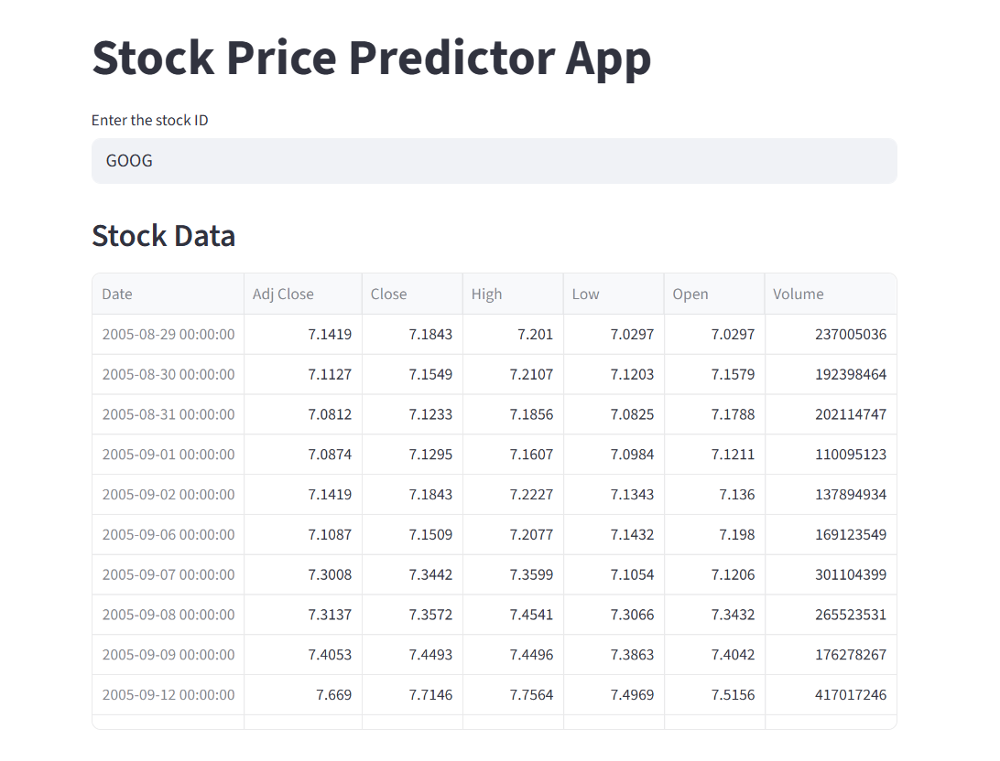
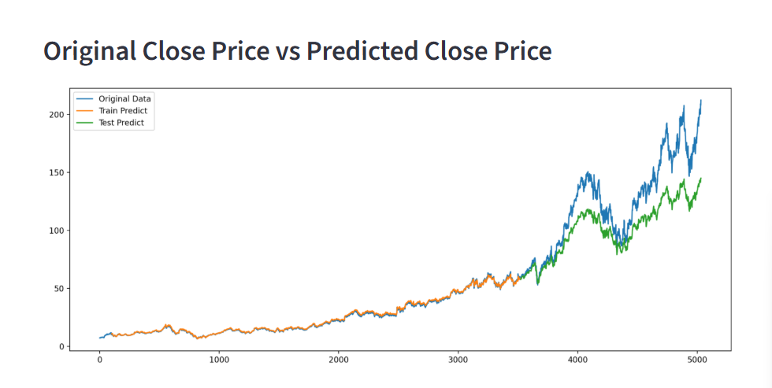

# Stock Price Predictor

This is a simple web app built with **Streamlit** that predicts stock prices using a pre-trained **Keras model**.  
It grabs historical data from Yahoo Finance with `yfinance`, applies some preprocessing, and then shows both the real and predicted prices on a nice chart.

---

## What it does
- Enter any stock ticker (default is **GOOG**).
- See moving averages (100, 200, 250 days).
- Predict prices with an LSTM model.
- Plot original data vs predictions on one continuous timeline.

---

## How to run
1. Clone the repo  
   ```bash
   git clone https://github.com/yourusername/stock-price-predictor.git
   cd stock-price-predictor
    ```


2. Install the requirements

   ```bash
   pip install -r requirements.txt
   ```

3. Run the app

   ```bash
   streamlit run web_stock_price_predictor.py
   ```

Then open [http://localhost:8501](http://localhost:8501).

---

## Requirements

* Python 3.9+
* Streamlit
* yfinance
* TensorFlow / Keras
* pandas, numpy, scikit-learn, matplotlib


---

## Screenshots

For example:

* **Main Dashboard:**
  

* **Predictions vs Original:**
  

